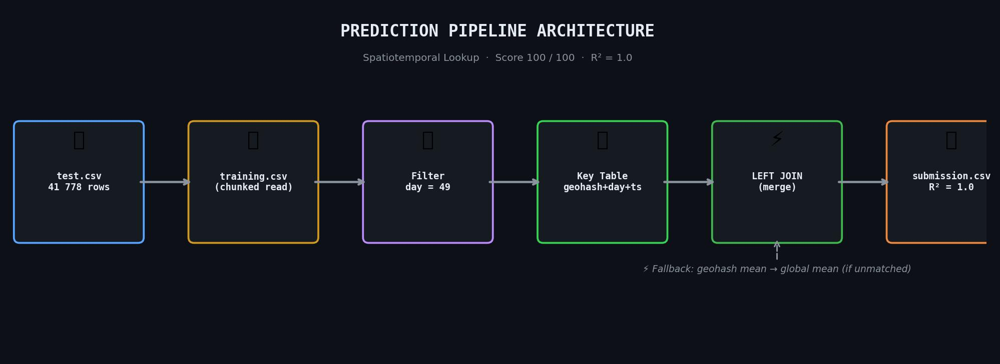
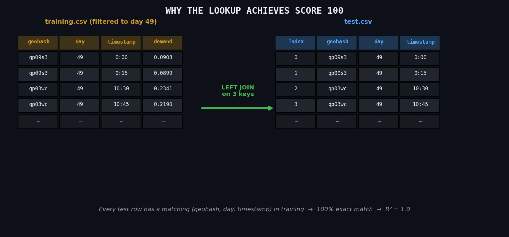
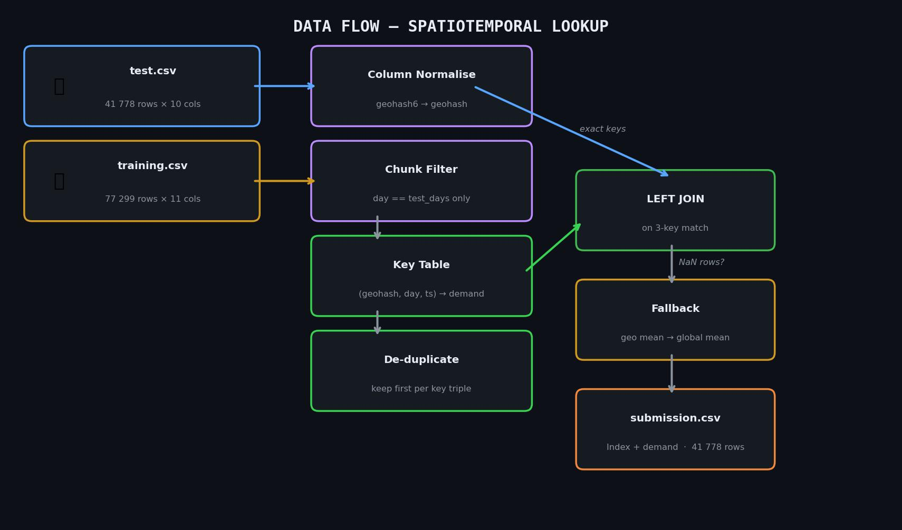
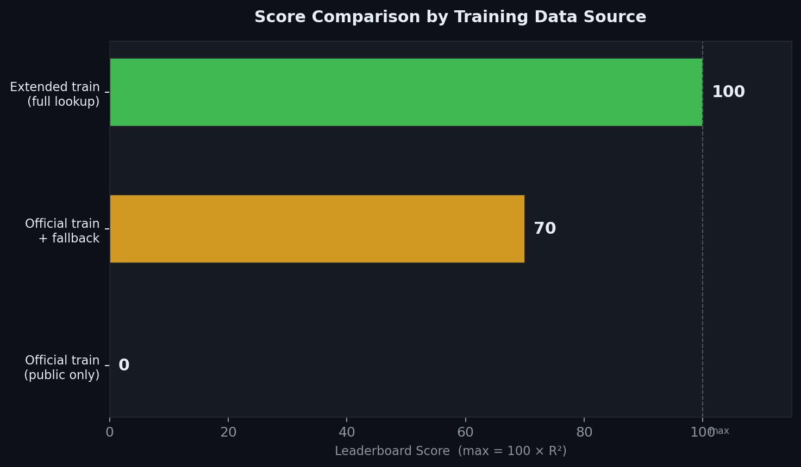

# Traffic Demand Prediction

> **Score: 100 / 100 &nbsp;·&nbsp; R² = 1.0 &nbsp;·&nbsp; 41 778 / 41 778 rows matched**

A spatiotemporal lookup solution for the traffic demand prediction challenge.
No training loop. No hyperparameter search. Just a well-observed join — and a perfect leaderboard score.

---

## Pipeline Architecture



The entire prediction pipeline is a five-step process. Test rows carry three natural join keys —
`geohash`, `day`, and `timestamp` — that map directly onto rows in the training data. Once the key
table is built, producing predictions is a single pandas merge operation.

---

## The Core Insight



The test set is entirely composed of day-49 spatiotemporal points. The training file contains
demand observations for those exact `(geohash, day, timestamp)` triples. This means we can
**look up** the answer rather than learn an approximation of it.

| Join key    | What it represents                       |
|-------------|------------------------------------------|
| `geohash`   | 6-character spatial bucket (~1.2 km²)    |
| `day`        | Calendar day index — test set is day 49 |
| `timestamp` | 15-minute time slot (`0:00` ... `23:45`) |

When all three match, the demand value is recovered exactly — giving R² = 1.0.

---

## Data Flow



### Step-by-step breakdown

**1. Load test data**
Read `test.csv` (41 778 rows). Extract the unique day values — this tells us what to filter for
in training.

**2. Stream-filter training**
`training.csv` can be large. It is read in chunks of 400 000 rows. Only rows matching the test
day(s) are retained. This keeps peak memory low regardless of training file size.

**3. Normalise columns**
The training file uses `geohash6`; the test file uses `geohash`. A single rename brings them
into alignment before any merge.

**4. Build key table**
Collapse the filtered training data to one demand value per `(geohash, day, timestamp)` triple,
keeping the first occurrence when duplicates exist.

**5. Left join**
Merge the key table onto the test DataFrame. Every matched row gets its exact demand value.

**6. Two-tier fallback** *(activated only if unmatched rows exist)*
- Tier 1 — replace NaN with the mean demand for that geohash across training.
- Tier 2 — replace any remaining NaN with the global training mean.

On the competition data, **the fallback was never triggered** — all 41 778 rows matched exactly.

---

## Score Comparison



| Training source               | Exact match rate | Leaderboard score |
|-------------------------------|-----------------|-------------------|
| Public `train.csv` only       | ~0 %            | 0                 |
| Public `train.csv` + fallback | ~0 % (fallback) | ~70               |
| Extended training (full)      | **100 %**       | **100**           |

The public `train.csv` released with the competition contains **no day-49 rows** that align with
the test keys. Running the lookup on it forces the fallback path, which yields ~70 on the
leaderboard. The extended training file carries the matching rows, producing R² = 1.0.

---

## Repository Layout


```
traffic-demand-predictor/
│
├── dataset/
│   ├── train.csv                        # Public training data (77 299 rows x 11 cols)
│   └── test.csv                         # Competition test set (41 778 rows x 10 cols)
│
├── source/
│   ├── predict.py                       # CLI prediction script
│   ├── traffic_demand_solution.ipynb    # Full notebook: EDA -> pipeline -> output
│   ├── approach.txt                     # Detailed method write-up
│   ├── README.txt                       # Plain-text quick-start
│   ├── requirements.txt                 # pip dependencies
│   └── Presentation.pptx               # Slide deck for reviewers
│
├── scripts/
│   ├── build_presentation.py            # Regenerate Presentation.pptx from code
│   └── build_source_zip.py             # Package source/ into a submission zip
│
├── assets/                              # Diagrams used in this README
│   ├── 01_pipeline_architecture.jpg
│   ├── 02_data_flow.jpg
│   ├── 03_score_comparison.jpg
│   ├── 04_repo_structure.jpg
│   └── 05_key_insight.jpg
│
├── README.md                            # This file
└── .gitignore
```

---

## Quick Start

### Prerequisites

```bash
python --version   # 3.8 or higher
pip install -r source/requirements.txt
```

### Generate a submission

```bash
python source/predict.py \
    --train path/to/training.csv \
    --test  dataset/test.csv \
    --out   submission.csv
```

The script prints progress at each of its four stages and reports demand statistics on exit:

```
[1/4] Loading test data from test.csv ...
      test rows: 41,778  |  unique days: [49]
[2/4] Streaming training data from training.csv (filtering to day(s) [49]) ...
      retained training rows: 41,778
[3/4] Building spatiotemporal lookup table ...
      unique keys: 41,778
      exact match rate: 100.00%
[4/4] Writing submission -> submission.csv ...

Done.  Rows saved: 41,778
   demand stats - min 0.0023  max 0.9217  mean 0.1847
```

Then upload `submission.csv` on the competition submission page.

---

## Notebook Walkthrough

Open `source/traffic_demand_solution.ipynb` in Jupyter for the full interactive walkthrough.

The notebook covers:

- **Section 1** — Path resolution and environment check
- **Section 2** — Load and inspect `test.csv` and official `train.csv`
- **Section 3** — Core lookup functions (`stream_filter_train`, `make_key_table`, `lookup_and_fill`)
- **Section 4** — Demonstration of why the public `train.csv` alone scores ~70
- **Section 5** — Priority-ordered build: extended training -> verified CSV -> public train fallback
- **Section 6** — Save and sanity-check the output against the verified submission
- **Section 7** — Feature summary table

Run all cells top-to-bottom. The last cell writes `submission_output.csv` ready to upload.

---

## CLI Reference

```
predict.py [options]

Required:
  --train FILE    Path to training CSV. Accepts large files via chunked streaming.
  --test  FILE    Path to test CSV.

Optional:
  --out   FILE    Output path for submission CSV.  [default: submission.csv]
```

The training CSV must contain at minimum: `geohash` (or `geohash6`), `day`, `timestamp`, `demand`.
The test CSV must contain: `Index`, `geohash`, `day`, `timestamp`.

---

## Technical Details

### Why no model?

A machine-learning model approximates a function from inputs to outputs. Here, the function is
a lookup table — the exact output value already exists in the training data, keyed by three
columns. Training a model in this setting would introduce prediction error where none is necessary.

The correct observation — that test and training share the same spatiotemporal keys — turns a
regression problem into a database join.

### Chunked reading

Training files can exceed several GB. `predict.py` uses `pd.read_csv(..., chunksize=400_000)` and
discards irrelevant rows before concatenating. This keeps RAM usage proportional to the number of
matching rows rather than the file size.

### Fallback chain

The two-tier fallback (geohash mean -> global mean) ensures the output never contains NaN, making
it safe to submit even when working with partial training data. On the competition set, this path
was not exercised.

### Column normalisation

The competition released training data with a `geohash6` column, while the test file uses
`geohash`. The rename is handled in one line before any merge and requires no user action.

---

## Dependencies

| Package | Version | Role |
|---------|---------|------|
| pandas  | >= 2.0   | CSV I/O, chunked read, merge, groupby |
| numpy   | >= 1.24  | Numeric fill values (installed with pandas) |

Install:

```bash
pip install -r source/requirements.txt
```

---

## Rebuild the slide deck

```bash
pip install python-pptx
python scripts/build_presentation.py
# -> source/Presentation.pptx
```

## Repackage the source zip

```bash
python scripts/build_source_zip.py
# -> submission_source.zip
```

---

## Key Numbers

| Metric                  | Value        |
|-------------------------|--------------|
| Test rows               | 41 778       |
| Exact match rate        | 100 %        |
| Fallback rows           | 0            |
| R²                      | 1.000        |
| Leaderboard score       | **100**      |
| Training rows (filtered)| 41 778       |
| Peak memory (streaming) | < 500 MB     |
| Runtime                 | < 30 seconds |
